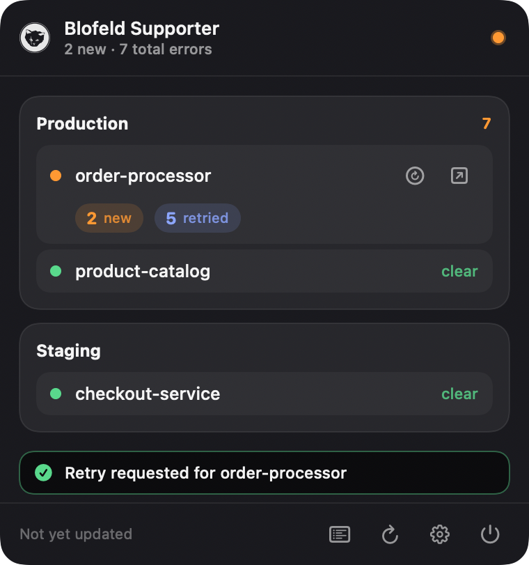

<div align="center">


# Blofeld Supporter

**Keep an eye on your NServiceBus error queues — right from the macOS menu bar.**



</div>

---

## What is it?

Blofeld Supporter is a tiny macOS app that lives in your **menu bar** and quietly watches your
[NServiceBus](https://particular.net/nservicebus) / [ServiceControl](https://docs.particular.net/servicecontrol/)
endpoints. Whenever messages start piling up in an error (dead-letter) queue, you see it at a glance —
no need to keep a ServicePulse tab open all day.

Click the menu-bar icon and a dark, compact panel drops down showing every endpoint you monitor and how
many errors it has, split into **new** and **already-retried**. If something is on fire, you can jump
straight to ServicePulse or trigger a retry without leaving the panel.

It has **no Dock icon and no window clutter** — just the icon in your menu bar.

## Features

- **At-a-glance error counts** per endpoint, grouped by host (e.g. _Production_, _Staging_).
- **New vs. retried** breakdown so you can tell fresh failures from ones already being reprocessed.
- **Desktop notifications** that fire only when an endpoint's error count actually *increases* — no nagging.
- **One-click retry** of an endpoint's error group, straight from the panel.
- **Jump to ServicePulse** for any endpoint to dig into the details.
- **Activity log** of recent changes, viewable in the panel.
- **Single sign-on aware** — if your ServiceControl sits behind an OAuth2 proxy, Blofeld opens a
  sign-in window the first time and remembers your session.
- **Configurable polling interval** and **launch-at-login**.

## Requirements

- macOS **14 (Sonoma)** or newer.
- Network access to one or more **ServiceControl** instances (and their matching **ServicePulse** URLs).

## Install

1. Download the latest **`Blofeld-x.y.z.dmg`** from the
   [**Releases page**](https://github.com/dannyyy/blofeld-supporter/releases/latest).
2. Open the DMG and **drag `Blofeld Supporter` onto the `Applications` folder**.
3. Launch it from Applications (or Spotlight). The icon appears in your menu bar — there is no Dock icon.

> The release builds are **signed with a Developer ID and notarized by Apple**, so they open without
> Gatekeeper warnings. If you build it yourself instead, macOS may ask you to confirm the first launch.

## Set up your hosts

The first time you open Blofeld, you'll want to tell it which endpoints to watch.

1. Click the menu-bar icon, then open **Settings** (the gear).
2. Under **Monitored Hosts**, click **＋** to add a host and give it a **Display name** (e.g. _Production_).
3. Fill in the two URLs:
   - **ServiceControl API** — e.g. `https://servicecontrol.example.com`
   - **ServicePulse** — e.g. `https://servicepulse.example.com`
4. Under **Endpoints**, add the **endpoint names** you want to watch (one per row, matching the names
   shown in ServicePulse, e.g. `order-processor`).
5. Repeat for as many hosts as you like.

Your changes show up in the panel **immediately** — you don't have to wait for the next poll.

If your ServiceControl is protected by single sign-on, Blofeld opens a browser window the first time it
needs to authenticate. Sign in once and it reuses the session for subsequent checks.

## Preferences

Open **Settings** from the panel to adjust:

- **Start at login** — launch Blofeld automatically when you log in.
- **Notifications** — get alerted when new errors appear (you may need to allow Blofeld under
  *System Settings ▸ Notifications* the first time; there's a **Send test notification** button to check).
- **Check every** — how often Blofeld polls each endpoint.
- **Diagnostics** — open the log file or reveal the configuration folder in Finder.

## Your data & privacy

Blofeld talks only to the ServiceControl/ServicePulse hosts **you** configure. Everything it stores stays
on your Mac, in `~/Library/Application Support/com.danflash.blofeld-supporter/`:

- `config.json` — your hosts, endpoints and preferences (with a one-deep backup that it restores from if
  the file ever gets corrupted).
- `blofeld.log` — a local activity log, also shown in the panel's Activity view.

## Building from source

Prefer to build it yourself? The app uses Swift Package Manager plus a small bundling script — **no Xcode
project required**:

```bash
swift build -c release   # compile
./build-app.sh           # assemble & sign Blofeld.app
open ./Blofeld.app       # launch
```

For the full developer guide — architecture, the DMG/notarization release pipeline, and testing notes —
see [`CLAUDE.md`](./CLAUDE.md).
